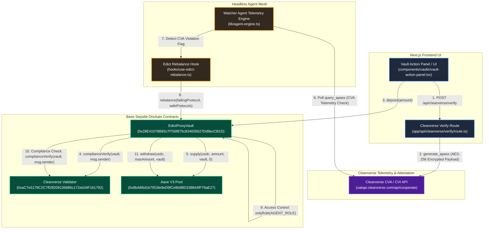

# Edict

> The Autonomous Compliance OS for Onchain Finance

---

Edict is an autonomous compliance operating system that sits above underlying DeFi liquidity venues (such as Aave V3) as a smart contract proxy vault architecture ([`EdictProxyVault.sol`](file:///Users/apple/.gemini/antigravity/scratch/edict/contracts/contracts/EdictProxyVault.sol)). It programmatically enforces real-time institutional regulatory compliance rules (Cleanverse Identity / CVI) directly onchain prior to executing capital operations like [`deposit`](file:///Users/apple/.gemini/antigravity/scratch/edict/contracts/contracts/EdictProxyVault.sol#L99) and [`withdraw`](file:///Users/apple/.gemini/antigravity/scratch/edict/contracts/contracts/EdictProxyVault.sol#L128).

To protect liquidity against real-time regulatory or counterparty risk, off-chain Watcher Agents continuously monitor Cleanverse CVA (Cleanverse Attestation / Audit) telemetry endpoints. Upon detecting a compliance failure or risk flag, the Watcher Agent invokes the vault's dual-guarded [`rebalance`](file:///Users/apple/.gemini/antigravity/scratch/edict/contracts/contracts/EdictProxyVault.sol#L158) function, executing an immediate flight-to-safety evacuation that liquidates position capital from failing venues and redistributes it into compliant protocols or sentinel idle vault reserves.

## System Data Flow & Telemetry Sequence

## Core Architecture

* **Dual-Track Execution Rails**:
  * **Next.js UI Track**: Interactive frontend application built with Next.js, Wagmi, and Viem ([`app/`](file:///Users/apple/.gemini/antigravity/scratch/edict/app), [`components/`](file:///Users/apple/.gemini/antigravity/scratch/edict/components)) managing user onboarding, CVI passport generation ([`app/api/cleanverse/verify/route.ts`](file:///Users/apple/.gemini/antigravity/scratch/edict/app/api/cleanverse/verify/route.ts)), single-asset USDC deposits and withdrawals ([`components/vaults/vault-action-panel.tsx`](file:///Users/apple/.gemini/antigravity/scratch/edict/components/vaults/vault-action-panel.tsx)), protocol health visualization ([`components/risk/protocol-health-matrix.tsx`](file:///Users/apple/.gemini/antigravity/scratch/edict/components/risk/protocol-health-matrix.tsx)), and manual evacuation simulation ([`components/risk/simulation-engine.tsx`](file:///Users/apple/.gemini/antigravity/scratch/edict/components/risk/simulation-engine.tsx)).
  * **Headless Agent Mesh Track**: Autonomous background telemetry engine ([`lib/agent-engine.ts`](file:///Users/apple/.gemini/antigravity/scratch/edict/lib/agent-engine.ts), [`hooks/use-agent.ts`](file:///Users/apple/.gemini/antigravity/scratch/edict/hooks/use-agent.ts)) that executes periodic compliance audits against Cleanverse CVA endpoints. Upon detecting protocol health breaches or regulatory non-compliance, it broadcasts onchain flight-to-safety transactions ([`hooks/use-edict-rebalance.ts`](file:///Users/apple/.gemini/antigravity/scratch/edict/hooks/use-edict-rebalance.ts)).

* **Cleanverse Integration Points**:
  * **Cleanverse Identity (CVI)**: Onchain credential verification system enforced via [`IAPassComplianceValidator.complianceVerify(poolAddress, userAddress)`](file:///Users/apple/.gemini/antigravity/scratch/edict/contracts/contracts/EdictProxyVault.sol#L29). Core contracts ([`EdictProxyVault.sol`](file:///Users/apple/.gemini/antigravity/scratch/edict/contracts/contracts/EdictProxyVault.sol) and [`EdictGovernance.sol`](file:///Users/apple/.gemini/antigravity/scratch/edict/contracts/contracts/EdictGovernance.sol)) assert valid Cleanverse A-Pass ownership prior to executing deposits, withdrawals, proposal creation, or voting.
  * **Cleanverse Attestation / Audit (CVA)**: Off-chain telemetry and compliance verification API suite communicating via AES-256-CBC encrypted REST payloads with Cleanverse cooperation endpoints (`https://uatapi.cleanverse.com/api/cooperate/query_apass` and `/generate_apass`). Watcher Agents poll these endpoints ([`scripts/query-apass.js`](file:///Users/apple/.gemini/antigravity/scratch/edict/scripts/query-apass.js), [`app/api/cleanverse/verify/route.ts`](file:///Users/apple/.gemini/antigravity/scratch/edict/app/api/cleanverse/verify/route.ts)) to evaluate pool compliance before triggering automated rebalancing.

## Security Architecture Matrix

| Security Layer | Target / Standard | Codebase File Path | Function / Method Name |
| :--- | :--- | :--- | :--- |
| **CVI Identity Verification** | Onchain A-Pass qualification check for depositors & withdrawers | [`contracts/contracts/EdictProxyVault.sol`](file:///Users/apple/.gemini/antigravity/scratch/edict/contracts/contracts/EdictProxyVault.sol#L101-L104) | [`validator.complianceVerify(address(this), msg.sender)`](file:///Users/apple/.gemini/antigravity/scratch/edict/contracts/contracts/EdictProxyVault.sol#L102) in `deposit()` & `withdraw()` |
| **Dual-Guard Agent Access** | Mandatory `AGENT_ROLE` access control plus onchain CVI verification for rebalancing | [`contracts/contracts/EdictProxyVault.sol`](file:///Users/apple/.gemini/antigravity/scratch/edict/contracts/contracts/EdictProxyVault.sol#L158-L164) | [`rebalance()`](file:///Users/apple/.gemini/antigravity/scratch/edict/contracts/contracts/EdictProxyVault.sol#L158) with `onlyRole(AGENT_ROLE)` modifier & `validator.complianceVerify()` |
| **CVA Telemetry & Attestation** | Encrypted AES-256-CBC telemetry auditing & off-chain CVA polling loop | [`lib/agent-engine.ts`](file:///Users/apple/.gemini/antigravity/scratch/edict/lib/agent-engine.ts#L21-L77) & [`app/api/cleanverse/verify/route.ts`](file:///Users/apple/.gemini/antigravity/scratch/edict/app/api/cleanverse/verify/route.ts#L33-L44) | [`startAgent()`](file:///Users/apple/.gemini/antigravity/scratch/edict/lib/agent-engine.ts#L8) telemetry tick & `POST` handler for `/api/cleanverse/verify` |
| **Governance Credential Enforcement** | Compliance-gated proposal creation & voting eligibility | [`contracts/contracts/EdictGovernance.sol`](file:///Users/apple/.gemini/antigravity/scratch/edict/contracts/contracts/EdictGovernance.sol#L38-L60) | [`createProposal()`](file:///Users/apple/.gemini/antigravity/scratch/edict/contracts/contracts/EdictGovernance.sol#L38) [onlyRole(GOVERNOR_ROLE)] & [`castVote()`](file:///Users/apple/.gemini/antigravity/scratch/edict/contracts/contracts/EdictGovernance.sol#L55) with `validator.complianceVerify()` |
| **Sentinel Idle Reserve & Cap Safety** | Deposit cap enforcement & isolated vault sentinel address reallocation | [`contracts/contracts/EdictProxyVault.sol`](file:///Users/apple/.gemini/antigravity/scratch/edict/contracts/contracts/EdictProxyVault.sol#L107-L108) & [`hooks/use-edict-rebalance.ts`](file:///Users/apple/.gemini/antigravity/scratch/edict/hooks/use-edict-rebalance.ts#L26-L29) | [`depositCap`](file:///Users/apple/.gemini/antigravity/scratch/edict/contracts/contracts/EdictProxyVault.sol#L41) guard & `triggerFlightToSafety()` sentinel vault target |

---

**Warning: Edict enforces strict CVI checks onchain. Testing deposits or rebalance actions requires the connected wallet to hold a valid Cleanverse A-Pass.**
