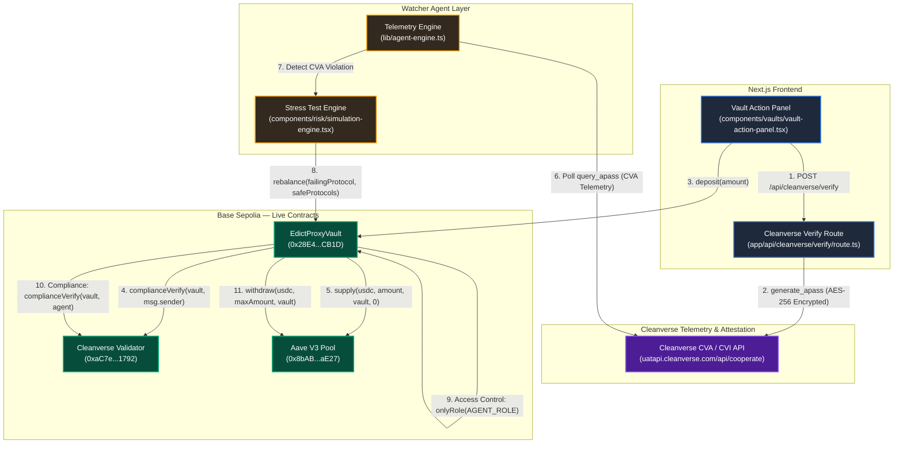

# Edict

> The Autonomous Compliance OS for Onchain Finance

---

Edict is an autonomous compliance operating system for institutional DeFi. It introduces a proxy vault architecture that programmatically enforces real-time regulatory compliance (Cleanverse CVI / CVA) directly onchain — before, during, and after capital deployment into underlying DeFi liquidity venues.

The system operates on two concurrent execution rails: a user-facing application for vault management and onboarding, and an autonomous Watcher Agent layer that continuously monitors compliance telemetry and executes defensive rebalancing when regulatory risk is detected.

## System Architecture



## Core Architecture

### Dual-Track Execution Rails

**User Application Track** — Interactive frontend built with Next.js, Wagmi, and Viem managing user onboarding, CVI passport generation via Cleanverse `generate_apass`, single-asset USDC deposits and withdrawals through the proxy vault, and protocol health visualization.

**Watcher Agent Track** — Application-runtime telemetry engine that executes periodic compliance audits against Cleanverse CVA endpoints using AES-256-CBC encrypted payloads. Upon detecting a compliance failure, the agent surfaces the violation and executes an onchain `rebalance()` transaction — a flight-to-safety evacuation from the failing venue into compliant protocols or the vault's sentinel idle reserve.

### Cleanverse Integration

Edict integrates with Cleanverse at two layers, following the CCP Integration Guide's **Single-Contract Mode** (Pattern 2, Method B — direct validator calls with native ERC20 assets):

**Cleanverse Identity (CVI)** — Onchain credential verification enforced via `IAPassComplianceValidator.complianceVerify(poolAddress, userAddress)`. The vault contract asserts valid Cleanverse A-Pass ownership prior to every state-changing operation: deposits, withdrawals, and agent-initiated rebalancing. The governance contract extends this to proposal creation and voting. Full RuleV2 lifecycle management is exposed through admin-gated wrappers (`setRuleV2FromContract`, `addRuleV2FromContract`, `removeRuleV2FromContract`).

**Cleanverse Attestation (CVA)** — Off-chain telemetry and compliance verification API communicating via AES-256-CBC encrypted REST payloads with Cleanverse cooperation endpoints. The Watcher Agent polls `query_apass` to evaluate ongoing vault compliance, while the onboarding flow calls `generate_apass` to issue A-Pass credentials to new users.

## Security Architecture

| Layer | Implementation | Contract Reference |
| :--- | :--- | :--- |
| **CVI Identity Verification** | `complianceVerify()` gate on `deposit()` and `withdraw()` — transactions revert for non-compliant wallets | `EdictProxyVault.sol` — `deposit()`, `withdraw()` |
| **Dual-Guard Agent Access** | `onlyRole(AGENT_ROLE)` modifier + `complianceVerify()` on `rebalance()` — agents must hold both the role and a valid A-Pass | `EdictProxyVault.sol` — `rebalance()` |
| **CVA Telemetry** | AES-256-CBC encrypted polling of Cleanverse `query_apass` with real-time violation detection | `lib/agent-engine.ts`, `app/api/cleanverse/cva/route.ts` |
| **Governance Credential Enforcement** | CVI-gated proposal creation (`GOVERNOR_ROLE` + `complianceVerify`) and voting eligibility | `EdictGovernance.sol` — `createProposal()`, `castVote()` |
| **Deposit Cap & Sentinel Reserve** | Configurable `depositCap` guard; vault address acts as idle reserve sentinel during flight-to-safety rebalancing | `EdictProxyVault.sol` — `depositCap`, `rebalance()` |

## Deployment

| Contract | Address | Network |
| :--- | :--- | :--- |
| **EdictProxyVault** | [`0x28E41078B83c7f756f875c834635627Dd9ecCB1D`](https://sepolia.basescan.org/address/0x28E41078B83c7f756f875c834635627Dd9ecCB1D) | Base Sepolia |
| **EdictGovernance** | Deployed separately | Base Sepolia |
| **Cleanverse Validator** | [`0xaC7e5179C2C7f03f209136886c172eb34F161792`](https://sepolia.basescan.org/address/0xaC7e5179C2C7f03f209136886c172eb34F161792) | Base Sepolia |
| **USDC (Testnet)** | `0xba50Cd2A20f6DA35D788639E581bca8d0B5d4D5f` | Base Sepolia |
| **Aave V3 Pool** | `0x8bAB6d1b75f19e9eD9fCe8b9BD338844fF79aE27` | Base Sepolia |

## Getting Started

```bash
# Clone and install
git clone <repo-url> && cd edict
npm install

# Configure environment
cp .env.example .env.local
# Fill in your Privy and Cleanverse API credentials

# Run development server
npm run dev

# Run tests
npm test

# Production build
npm run build
```

### Smart Contracts

```bash
cd contracts
npm install

# Deploy to Base Sepolia
npx hardhat run scripts/deploy.js --network baseSepolia

# Grant AGENT_ROLE (for rebalance execution)
npx hardhat run scripts/grant-agent-role.js --network baseSepolia
```

## Technology Stack

| Layer | Technology |
| :--- | :--- |
| **Frontend** | Next.js 16, React 19, TypeScript |
| **Styling** | Tailwind CSS 4, Framer Motion |
| **Wallet** | Privy, Wagmi, Viem |
| **State** | Zustand |
| **Charts** | Recharts |
| **Contracts** | Solidity 0.8.20, OpenZeppelin AccessControl, Hardhat |
| **Network** | Base Sepolia (L2) |
| **Compliance** | Cleanverse CCP (CVI + CVA) |

## Roadmap

Edict's proxy vault architecture is designed as a foundation for institutional-grade compliant DeFi infrastructure.

**ERC-4626 Vault Standard** — Migrate the vault to a tokenized ERC-4626 architecture built on [Euler Earn](https://docs.euler.finance/euler-vault-kit-white-paper/), providing a composable, audited vault framework with standardized share accounting, multi-strategy allocation, and battle-tested security primitives. Euler Earn's modular design aligns with Edict's multi-protocol rebalancing model and provides the structural foundation needed for institutional adoption.

**Cleanverse Institutional Trust Layer** — As Cleanverse's CVI and CVA primitives mature, Edict's compliance enforcement extends naturally: CVI provides the identity verification rails that institutional allocators require, while CVA-compatible asset integration would enable automatic compliance propagation at the token transfer level — eliminating the need for per-operation validator calls entirely.

**Multi-Chain Expansion** — Extend vault deployment across EVM-compatible L2s, with chain-specific validator registrations and cross-chain compliance state.

**Multi-Protocol Allocation** — Expand the rebalancing engine to actively allocate across multiple DeFi venues simultaneously, with protocol-specific risk scoring derived from CVA telemetry.

---

> **Note:** For testing purposes, please [get ETH (Base Sepolia)](https://docs.base.org/base-chain/network-information/network-faucets) and USDC from [this faucet](https://app.aave.com/faucet/?marketName=proto_base_sepolia_v3).

> **Note:** Edict enforces CVI checks onchain. Deposits, withdrawals, and rebalance operations require the connected wallet to hold a valid Cleanverse A-Pass.

## License

[MIT](./LICENSE)
